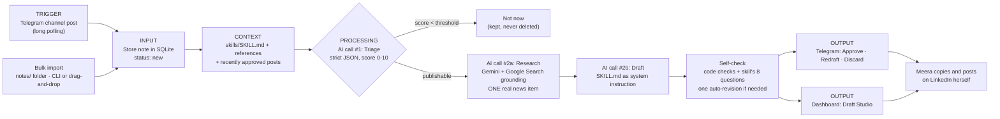

# Skinstinct Draft Lab

A drafting assistant for **Meera Pillai**, founder of Skinstinct. She drops raw notes (observations, two-liners, voice-note transcripts) into a Telegram channel. The app keeps every note, scores which ones are worth developing, and drafts the strongest into LinkedIn posts **in her voice**, each with a current, real news angle. Drafts come back to her in Telegram and in a web dashboard for review.

Target rhythm: **3 posts a week** without it eating her time.

## Drafts only - this app never posts to LinkedIn

This is a deliberate design decision, not a missing feature. Meera wants full control over what goes out under her name, so:

- There is **no LinkedIn API, no OAuth, no auto-publishing and no scheduling to LinkedIn** anywhere in this codebase. A test (`tests/test_no_linkedin.py`) fails if any is added.
- **Approve** means "approved for Meera to copy and post herself". It records a status and publishes nothing.
- Unverified facts appear inline as `[VERIFY: ...]` and are highlighted in both Telegram and the dashboard, so nothing unchecked slips out.

## How it works



1. **Trigger** - the bot long-polls Telegram, so no public URL is needed. It handles `channel_post` (channels) and `message` (groups/DMs) updates and **ignores anything not from `TELEGRAM_CHAT_ID`**.
2. **Input** - every note goes into SQLite with the status `new → triaged → drafted → approved / discarded`. Notes scored below the threshold show as "not now" with the reason. They are never deleted.
3. **Context** - `skills/SKILL.md` (Meera's voice guide) plus its two reference files are loaded **verbatim** as the system instruction. The last few approved drafts are passed in so topics don't repeat.
4. **Triage** (AI call #1) - Gemini returns strict JSON: `score`, `publishable`, `category` (one of the skill's four content pillars), `core_insight`, `suggested_hook_type`, `missing_facts`, `reason`. The JSON is validated with Pydantic, with one retry if parsing fails.
5. **Research** (AI call #2a) - Gemini with Google Search grounding looks for ONE current news item or industry data point, preferring Indian sources. **A source is only accepted if it appears in Google's grounding metadata**, so the model can't invent one. If nothing credible turns up, the draft goes ahead without an angle and says so.
6. **Draft** (AI call #2b) - the post is written using the skill's 6-beat arc, sentence rules and format rules.
7. **Self-check** - code checks word count, emojis, hashtags, bullets, bold/headers, em dashes, question hooks, hype words, CTAs, British spelling and `[VERIFY]` markers. The model then answers the skill's own 8 self-check questions (parsed from `SKILL.md`). If anything fails, the draft gets one automatic revision.
8. **Output** - the draft goes to Telegram with **✅ Approve · ✏️ Redraft · 🗑️ Discard** buttons, and appears in the dashboard.

### Auto-review (auto-approve / auto-discard)

Every draft gets a **quality score out of 10**, and a rule decides what happens next. "Approved" still only means *ready for Meera to copy and post herself*. Nothing is ever published.

**Score** = 0.45 × voice + 0.25 × self-check + 0.30 × note substance − 2 per format failure − 3 per invented claim

- **Voice (0-10):** a sceptical reviewer pass compares the draft with her four published posts, using an anchored rubric in which most first drafts land at 6-8.
- **Self-check:** the share of the skill's 8 self-check questions passed.
- **Note substance:** the source note's triage score. A post can't be better than its raw material, so a fluent post padded out of a two-line note can't auto-approve.
- **Invented claims:** the reviewer compares the draft with the raw note and fact sheet, and flags any scene, event, conversation or number presented as Meera's that isn't in either.

| Score | What happens |
|---|---|
| **8-10** | ✅ **Auto-approved**, unless a safeguard below applies |
| **7** | 👀 Goes to Meera, as before |
| **0-6** | ↻ One automatic redraft using the reviewer's feedback. If still below 7: 🗑️ **auto-discarded** (the note is kept) |

**Safeguards on top of the score:**

- **Unfilled `[VERIFY]` facts block auto-approval.** The draft goes to **needs facts**. Meera taps ✍️ *Fill facts* in Telegram and replies with one answer per line, or uses the Fill-the-facts panel in the dashboard. Once nothing is left to fill and it still scores 8+, it auto-approves.
- **Invented details are never auto-approved,** whatever the score. They're flagged 🚩 in Telegram and the dashboard.
- **Drafts Meera asked for are never auto-discarded.** A redraft she requested always comes back to her.
- **Every automatic call is reversible:** ↩️ *Undo approval* and ♻️ *Restore* in Telegram, or *Undo* / *Restore* in the Draft Studio.

All thresholds live in `.env`: `AUTO_REVIEW`, `AUTO_APPROVE_MIN`, `AUTO_DISCARD_BELOW` and `AUTO_APPROVE_WITH_VERIFY`. Set `AUTO_REVIEW=false` to review every draft by hand.

**Weekly rhythm:** every **Monday 09:00 IST**, the scheduler scores any new notes and drafts the top 3 for the week. You can also use **Draft next best note** in the dashboard or `/draft` in Telegram at any time.

### The voice skill

`skills/SKILL.md` and `skills/references/*.md` come from the `meera-linkedin-voice` skill, copied unmodified. Its **four content pillars** (Ingredient Deep-Dive, Founder Story, India-Specific Context, Industry Transparency) are the triage categories. Its **400-550 word** range and **8-question self-check** drive the validator. The app appends one short note asking for placeholders in the `[VERIFY: ...]` form the UI highlights. It does not change any rule in the skill.

## Setup

### 1. Create the Telegram bot

1. In Telegram, message **@BotFather** and send `/newbot`. Follow the prompts, then copy the **bot token**.
2. Create a channel for Meera's notes (or use the existing one).
3. **Add the bot to the channel as an administrator.** Bots only receive channel posts when they are admins, so this step is required. It needs *Post messages* (to send drafts) and nothing else.
4. Get the channel's chat ID. It starts with `-100`. One way: post something in the channel, then open `https://api.telegram.org/bot<token>/getUpdates` in a browser and read `channel_post.chat.id`.

> Groups and DMs also work: set `TELEGRAM_CHAT_ID` to that chat's ID. In a group, disable *Group Privacy* in BotFather (`/setprivacy`) so the bot sees normal messages.

### 2. Get a Gemini API key

Create one at <https://aistudio.google.com/apikey>. The default model is `gemini-3.8-flash`, which supports Grounding with Google Search. Override it with `GEMINI_MODEL` if needed.

### 3. Configure `.env`

```bash
cp .env.example .env
```

Fill in `TELEGRAM_BOT_TOKEN`, `TELEGRAM_CHAT_ID` and `GEMINI_API_KEY`. `.env` is git-ignored. **Never commit it, and never put real values in `.env.example`.**

| Variable | Default | Purpose |
|---|---|---|
| `TELEGRAM_BOT_TOKEN` | - | From BotFather |
| `TELEGRAM_CHAT_ID` | - | The one chat the bot listens to (channel IDs start with `-100`) |
| `GEMINI_API_KEY` | - | Google AI Studio key |
| `GEMINI_MODEL` | `gemini-3.8-flash` | Must support Google Search grounding |
| `TRIAGE_THRESHOLD` | `7` | Notes scoring below this are "not now" |
| `DATABASE_URL` | `sqlite:///skinstinct.db` | SQLite file |
| `ENABLE_BOT` / `ENABLE_SCHEDULER` | `true` | Turn off to run the dashboard alone |

### 4. Install

Needs Python 3.11+ and Node 18+.

```bash
python -m venv .venv
.venv/bin/pip install -e ".[dev]"      # Windows: .venv\Scripts\pip install -e ".[dev]"
cd web && npm install && cd ..
```

(`make install` does the same, using `uv` if you have it.)

### 5. Run

```bash
make dev          # macOS/Linux: API + bot on :8000, dashboard on :5173
./dev.ps1         # Windows PowerShell equivalent
```

Open <http://localhost:5173>. For a single-process "production" run, build the dashboard and let FastAPI serve it:

```bash
make serve        # = npm run build + python -m app.cli serve  → http://127.0.0.1:8000
```

### Importing the backlog

```bash
python -m app.cli import path/to/notes/      # .txt / .md, recursive, duplicates skipped
python -m app.cli triage                     # score everything
python -m app.cli draft-next                 # draft the best one and print it
```

Or drag the folder onto the **Backlog** screen. To try it with no real data, import `samples/`, which holds five fake notes of deliberately mixed quality.

## Using it

**Telegram** (in the configured chat):

| | |
|---|---|
| *any text* | Stored as a note (captions count; edits and commands don't) |
| `/start` | What the bot does |
| `/status` | Counts per status and this week's progress (x/3) |
| `/draft` | Draft the next best note (about a minute) |
| `/backlog` | Top 5 unused notes with scores |
| ✅ Approve | Marks the draft approved for you to post manually |
| ✍️ Fill facts | Reply with the [VERIFY] facts, one per line; the draft auto-approves if it then scores 8+ |
| ↩️ Undo · ♻️ Restore | Reverse an automatic approval or discard |
| ✏️ Redraft | Reply to the bot's prompt with a one-line instruction, or tap *Just redraft* |
| 🗑️ Discard | Discards the draft. The note is kept |

**Dashboard:**

- **Inbox** - every note, with score, category, status and a one-line triage reason. Filter by status or category.
- **Draft Studio** - on the left, the original note, the triage "assay" (with raw JSON) and the news-angle card with its source link. On the right, a LinkedIn-style preview with `[VERIFY]` highlighted, live word count, checklist ticks, inline editing, Copy, Redraft with instruction, Approve and Discard.
- **This Week** - progress toward 3 approved posts, the review queue, and when the next automatic batch runs.
- **Backlog** - ranked unused notes with a Draft button, drag-and-drop folder import, and a quick-add box.

## Project layout

```
app/
  config.py            settings from .env (python-dotenv), nothing hardcoded
  main.py              FastAPI app; starts the bot + scheduler in its lifespan
  cli.py               import / triage / draft / weekly / serve
  scheduler.py         APScheduler: Mondays 09:00 IST
  db/                  SQLModel tables, session, query helpers
  pipeline/
    skill.py           loads SKILL.md + references verbatim
    gemini.py          google-genai client, retries on 429/5xx
    triage.py          AI call #1 + Pydantic validation
    research.py        AI call #2a, grounded news angle
    draft.py           AI call #2b + self-check + one revision
    checklist.py       deterministic format checks
    orchestrator.py    ties it together; approve/discard/edit
  bot/                 python-telegram-bot v21+ handlers, chat filter, formatting
  api/                 REST routes for the dashboard
web/                   React + Vite + TypeScript + Tailwind + Framer Motion
skills/                Meera's voice skill (unmodified)
samples/               5 fake notes for demos
tests/                 pytest
```

## Tests

```bash
make test         # or: .venv/bin/python -m pytest -q
```

These cover triage JSON parsing and the retry, the checklist validator (emojis, hashtags, bullets, word count, dashes, hooks), the chat-ID filter for channel posts and messages, grounding-only sources, an offline end-to-end run with Gemini stubbed, and the no-LinkedIn guardrail. None of them need API keys.

## Operational notes

- **Rate limits:** Gemini calls retry with exponential backoff on 429/5xx. If Gemini stays down, the bot and dashboard say so instead of failing silently. Telegram sends retry on flood control and network errors, and polling recovers from dropped connections by itself.
- **Logs:** `httpx` request logging is turned down so the bot token (which is part of Telegram API URLs) never appears in logs.
- **Voice notes:** the bot stores text and captions. Send voice-note *transcripts* as text. Audio transcription isn't built in.
- The scheduler runs inside the app process, so the Monday batch only happens while the app is running. If the machine was asleep at 09:00, it still runs when the app wakes, up to six hours late.
